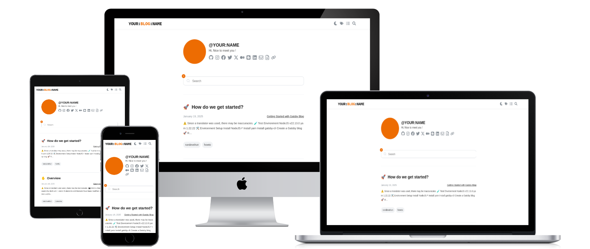

<h1 align="center">
  👋
</h1>
<h1 align="center">
  gatsby-starter-rundevelrun
</h1>


## 🎬 시작



[devHudi↗](https://github.com/devHudi/gatsby-starter-hoodie)님의 원본 소스를 바탕으로 일부 UI 요소와 기능을 수정하여 제작하였습니다.
지속적인 업데이트를 하면서 부족한 부분을 고쳐나가겠습니다.

소스를 공개해주셔서 감사합니다.

## ▶️️ Live Demo

> [https://6developer.com](https://6developer.com)

## ✅ 주요 기능

> - Adsense
>   - 본문 상/하단, ToC 하단, 리스트 사이에 광고 삽입 (Update. 2025-01-21)
>  <br/> <br/>
> - SEO
>   - SEO 최적화 (Update. 2025-01-19)
> <br/> <br/>
> - 마크다운
> - 코드 하이라이팅
> - Katex 문법
> - 다크모드 (OS 환경설정과 연동)
> - 태그 분류
> - 시리즈 분류
> - 반응형 웹
> - Giscus


## 🧪 테스트 환경
> NodeJS v22.13.0 <br/>
> yarn 1.22.22

## 🛠️ 환경 설정
1. [NodeJS↗](https://nodejs.org/ko/download) 설치
2. yarn 설치
   ```shell
   npm install -g yarn
   ```
3. gatsby-cli 설치
   ```shell
   yarn global add gatsby-cli
   ```
4. Gatsby 블로그 생성
   ```shell
   gatsby new your-blog-name https://github.com/rundevelrun/gatsby-starter-rundevelrun.git
   ```

## 🚀 개발 환경 구동
아래 과정을 거친 후 `http://localhost:8000`으로 접속
1. 의존성 패키지 설치
   ```shell
   cd your-blog-name
   yarn install
   ```
2. 구동
   ```shell
   yarn develop
   ```

## ☺️ 사용자화
`blog-config.js`의 내용 수정

```javascript
module.exports = {
  title: "YOUR:BLOG:NAME",    // SEO Blog title
  headerTitle: "YOUR:<em style='color:#ed6c02'>BLOG</em>:NAME", // Logo 1
  headerSubTitle: "<em style='color:#ed6c02'>YOUR</em>:BLOG:<em style='color:#ed6c02'>NAME</em>", // Logo 2
  copyright: "©YOUR:BLOG:NAME", // copyright in footer
  author: "YOUR:NAME",  // Your Name
  siteUrl: "https://6developer.com/", // Your Site URL
  description: "Hi, Nice to meet you !",  // Blog description
  links: {
    github: "https://github.com/rundevelrun",
    ...
  },
  giscus: {
    ...
  },
  adsense: { 
    ...
  }
}
```

## 📝 게시글 작성
1. `contents/posts` 폴더에 게시글 파일 생성 (두가지 방법)
    1. pathname으로 사용할 이름의 폴더를 만들고 하위에 'index.md'를 생성
    2. pathname으로 사용할 이름으로 `*.md` 파일 생성
2. frontmatter 작성
   ```yaml
   ---
   emoji: "🚀"
   title: "어떻게 시작할까요?"
   date: 2025-01-19 13:53:00
   update: 2025-01-19 13:53:00
   tags:
      - rundevelrun
      - howto
   series: "Gatsby 블로그 시작하기"
   ---
   ```