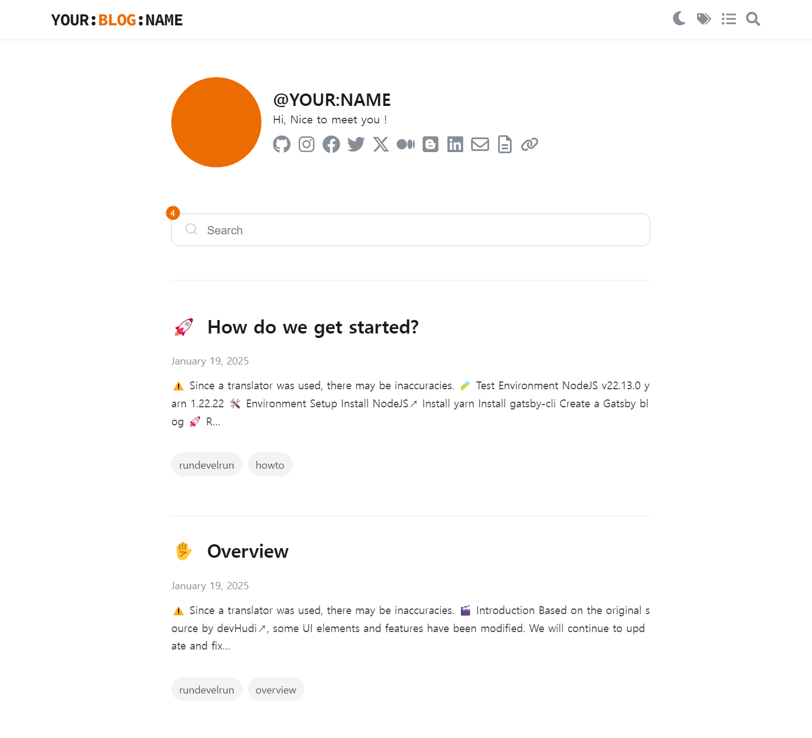

<h1 align="center">
  👋
</h1>
<h1 align="center">
  gatsby-starter-rundevelrun
</h1> 

> ⚠️ Since a translator was used, there may be inaccuracies.

> [한국어로 보기](https://github.com/rundevelrun/gatsby-starter-rundevelrun/blob/develop/README-kr.md)

## 🎬 Introduction



Before using Gatsby, I managed a personal blog with Jetbrains' [Writerside↗](https://www.jetbrains.com/help/writerside/discover-writerside.html). While I was quite satisfied with the design elements, the tool, being primarily intended for document purposes, had many shortcomings for blog management (such as lack of RSS Feed support, difficulty in customization, and no GraphQL support).

Fortunately, I was able to get started with Gatsby thanks to [devHudi↗](https://github.com/devHudi/gatsby-starter-hoodie), who generously shared a very well-crafted source on GitHub. Although I made some modifications to suit my needs, most of the source was created based on the original.

I extend my deep gratitude.

## ▶️️ Live Demo

> [https://6developer.com](https://6developer.com)

## ✅ Key Features

The key features are derived from the contributions of [devHudi↗](https://github.com/devHudi/gatsby-starter-hoodie):
> - Markdown
> - Code highlighting
> - Katex syntax
> - Dark mode (integrated with OS settings)
> - Tag classification
> - Series classification
> - Responsive web design
> - SEO
> - Giscus

## ✍️ Modified Content

### 2025.01.19
1. In addition to the title used for SEO, headerTitle and headerSubTitle have been added.
    - headerTitle and headerSubTitle support HTML tags.
    - If headerSubTitle is present, the Title area changes every 5 seconds.
2. Added 'emoji' to the Frontmatter
    - This is to ensure that only titles without emojis are displayed in the SEO Title.
3. SEO modifications
    - The blog title has been added after the post title. <br/> e.g. 'Overview | YOUR:BLOG:NAME'
    - On the '/' page, only the blog title is displayed. <br/> e.g. 'YOUR:BLOG:NAME'
4. A search function has been added to the '/' page.
5. The number of posts found is displayed as a Badge on the '/' and '/search' pages.
6. The title and copyright have been separated.
7. Some UI elements have been changed.


## 🧪 Test Environment
> NodeJS v22.13.0 <br/>
> yarn 1.22.22

## 🛠️ Environment Setup
1. Install [NodeJS↗](https://nodejs.org/en/download)
2. Install yarn
```shell
npm install -g yarn
```
3. Install gatsby-cli
```shell
yarn global add gatsby-cli
```
4. Create a Gatsby blog
```shell
gatsby new your-blog-name https://github.com/rundevelrun/gatsby-starter-rundevelrun.git
```

## 🚀 Running Development Environment
After completing the steps below, access `http://localhost:8000`
1. Install dependency packages
```shell
cd your-blog-name
yarn install
```
2. Start
```shell
yarn develop
```

## ☺️ Customization
Edit the contents of `blog-config.js`

```javascript
module.exports = {
   title: "YOUR:BLOG:NAME",    // SEO Blog title
   headerTitle: "YOUR:<em style='color:#ed6c02'>BLOG</em>:NAME", // Logo 1
   headerSubTitle: "<em style='color:#ed6c02'>YOUR</em>:BLOG:<em style='color:#ed6c02'>NAME</em>", // Logo 2
   copyright: "©YOUR:BLOG:NAME", // copyright in footer
   author: "YOUR:NAME",  // Your Name
   siteUrl: "https://6developer.com/", // Your Site URL
   description: "Hi, Nice to meet you !",  // Blog description
   links: {
      github: "https://github.com/rundevelrun",
      ...
   },
   giscus: {
      ...
   },
}
```

## 📝 Writing Posts
1. Create a post file in the `contents/posts` folder (two methods)
    1. Create a folder with the name to be used as the pathname and create an 'index.md' inside it
    2. Create a `*.md` file with the name to be used as the pathname
2. Write frontmatter
   ```yaml
   ---
   emoji: "🚀"
   title: "2. How do we get started?"
   date: 2025-01-19 13:53:00
   update: 2025-01-19 13:53:00
   tags:
      - rundevelrun
      - howto
   series: "Starting a Gatsby Blog"
   ---
   ```